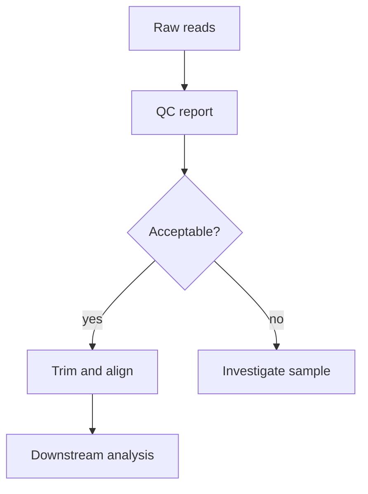

# Bioinformatics Sequence Quality Control

Quality control is the habit of asking whether the data are trustworthy before interpreting biological signal.

测序数据分析的第一步不是立刻跑差异分析，而是先确认数据是否可靠、是否有明显异常、是否适合进入下游流程。

## Core idea

For sequencing reads, quality control usually checks:

- per-base quality score
- adapter contamination
- GC content distribution
- duplicated reads
- read length distribution
- sample-level outliers

## Why it matters

Low-quality bases can create false variants, noisy alignments, or unstable abundance estimates.

One compact way to remember the goal:

$$
\text{trustworthy result} \approx \text{good design} + \text{clean data} + \text{appropriate model}
$$

## Minimal workflow

## Related notes

- [[statistics-linear-model-thinking]]
- [[coding-reproducible-python-workflow]]

## Open questions

- What thresholds should be project-specific instead of copied from tutorials?
- How should QC decisions be documented for reproducibility?
