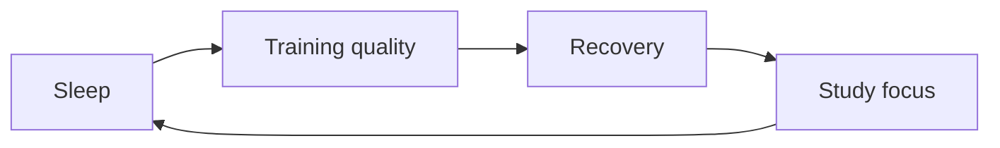

# Fitness Log Example

This is a public-safe fitness note. Keep exact personal metrics in a private place if needed.

这是公开版训练记录，只保留节奏、感受和复盘，不放敏感细节。

## Session

- Warm-up: mobility and light cardio
- Main work: lower-body strength practice
- Cool-down: breathing and stretching

## Reflection

The goal is consistency. The best plan is the one that leaves enough recovery for study and writing.

## Pattern to watch

## Next adjustment

Keep the plan simple and increase difficulty slowly.
