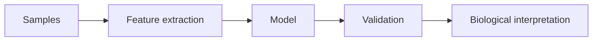

# Paper Reading Template In Action

This is an example paper note. Replace the placeholder paper with a real paper when writing.

这篇示例展示如何从论文中提炼问题、方法和可复用思路，而不是只保存摘要。

## Citation

- Authors: Example Author et al.
- Year: 2026
- Field: Bioinformatics
- Link: add DOI or official paper link when available

## One-sentence summary

The paper proposes a computational workflow for turning noisy biological measurements into interpretable patterns.

## Research question

What makes the biological signal distinguishable from technical variation?

## Method map

## Reusable ideas

- Separate measurement quality from biological interpretation.
- Report assumptions before discussing conclusions.
- Connect results back to study design.

## Links

- [[bioinformatics-sequence-quality-control]]
- [[statistics-linear-model-thinking]]

## Follow-up

- Which validation step would be weakest in a small cohort?
- What would change if the data were longitudinal?
