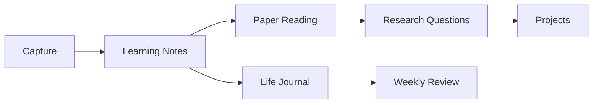

# Qinzi27 Academic Garden

<div class="garden-hero">
  <div>
    <p class="garden-kicker">Academic notes, soft edges.</p>
    <h2>把长期学习、论文阅读和一点生活感，整理成能慢慢长大的知识花园。</h2>
    <p>Bioinformatics, statistics, coding, research reading, PhD preparation, and selected life reflections in Chinese and English.</p>
  </div>
</div>

欢迎来到这个长期笔记花园。这里主要保存学术学习、论文阅读、统计与编程实践、博士申请准备，以及经过筛选的生活记录。

Welcome. This is a long-term Markdown garden for academic learning, research reading, statistics, coding, PhD preparation, and selected life writing.

## Main spaces

<div class="garden-card-grid">
  <a class="garden-card" href="./about"><span>01</span><strong>About</strong><em>site purpose and structure</em></a>
  <a class="garden-card" href="./now"><span>02</span><strong>Now</strong><em>current focus and priorities</em></a>
  <a class="garden-card" href="./learning-notes/"><span>03</span><strong>Learning Notes</strong><em>bioinformatics, statistics, coding</em></a>
  <a class="garden-card" href="./research--and--papers/"><span>04</span><strong>Research & Papers</strong><em>paper reading and research questions</em></a>
  <a class="garden-card" href="./life-journal/"><span>05</span><strong>Life Journal</strong><em>weekly reviews and selected life writing</em></a>
  <a class="garden-card" href="./projects/"><span>06</span><strong>Projects</strong><em>experiments and PhD preparation</em></a>
</div>

## Publishing rule

Public notes use both fields below:

```yaml
publish: true
privacy: public
```

加密笔记使用单独的受保护发布流程。Drafts, raw notes, personal archives, message exports, attachments, and PDF folders are ignored by the Quartz build and checked before publishing.

<div class="privacy-note">
  <strong>Privacy-first workflow</strong>
  <p>素材、私人记录和原始材料先放在未发布区域；只有确认可公开的 Markdown 和图片才进入公开目录。</p>
</div>

## Example map


